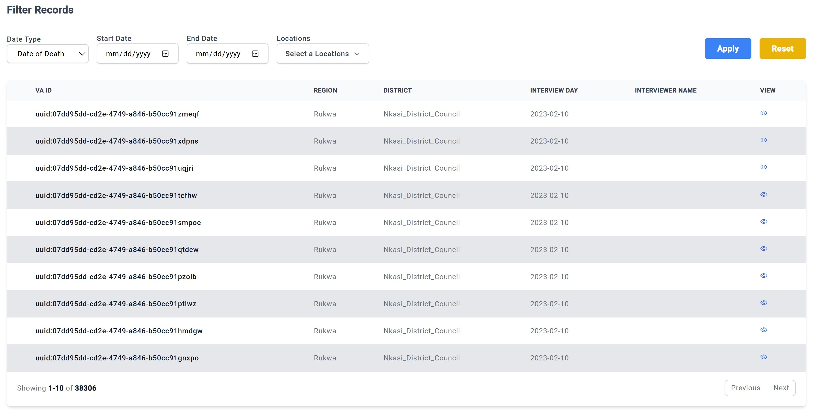

# VA Records
## Intro

The second tab is designed to facilitate a more granular examination of the Verbal Autopsy (VA) records, providing users with the ability to delve into individual data entries. This feature is particularly useful for researchers and analysts seeking to extract detailed insights from the dataset.

Each record displayed in this tab begins with the VA ID, a unique identifier assigned to every individual entry to ensure precise tracking and differentiation within the database. Alongside this, the tab highlights critical contextual information, including the geographic region and district where the VA interview was conducted. These details help in regional analysis and cross-referencing with other data sources.

Additionally, the interface presents the specific date on which the interview took place, offering a temporal perspective that can be valuable for time-based trend analysis. The name of the interviewer is also included, providing an added layer of accountability and enabling further follow-ups if necessary.

This tab serves as a cornerstone for users who require a detailed and structured view of the VA records, ensuring transparency and ease of access to key data points. 

## Viewing

To access additional details for individual records, users can click on the view icon, represented by an **eye icon** located at the far right of each record.

Selecting the eye icon opens a floating panel that provides an in-depth view of the specific VA entry. This panel is organized into two sections for clarity and usability.

On the left-center of the panel, detailed information is displayed, including the prompts associated with the VA, their corresponding Question IDs, descriptive labels, and the recorded responses. This structured format ensures that each element of the VA is clearly identified and easily interpretable.

On the right side of the panel, a comprehensive VA summary is presented. This summary consolidates key data points, offering a quick yet detailed overview of the record's essential findings.

This functionality enhances the user experience by enabling seamless navigation and in-depth analysis of individual VA records directly from the interface.

## Filtering Records

One has the options to filter the data being viewed by using the filter option found at the top of most tabs.

Filtering can be done under the following parameters, 
 - Date Type: Choose from the following selection. 
(I).	Submission date
(II).	Date of death
(III).	Interview date
 - Start date: Select the desired starting date for the dataset.
 - End date: Select the desired ending date for the data set
 - Locations: Select the location from which records should be retrieved.
 
Once satisfied with the choices click **APPLY** on the far right to apply the changes to the charts. Click Reset to revert the filters back to their default parameters. 

For the momemt this Panel and it's details can not be donwloaed. 

