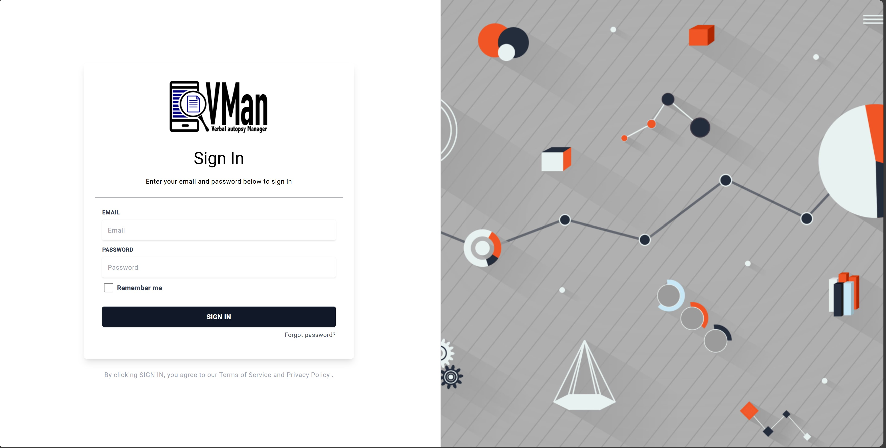

# Introduction
## Foreword

The VMan tool is a unified platform designed to integrate key features from both VMan and VATool, offering enhanced functionality and adaptability across various countries. It brings together the best elements of these tools and incorporates global best practices and recommendations from the VA-IT group to create a powerful, all-in-one solution for data management and visualization.

This tool focuses on improving data quality by ensuring completeness, consistency, and accuracy. It uses advanced technical methods like system-to-system integration through Application Programming Interfaces (APIs) and Object-Oriented Programming for role- and level-based access control. With built-in error-checking mechanisms and adherence to Digital Adaptation Kit (DAK) standards, it provides reliable and standardized processes.

The VMan tool features standardized dashboards that align with global standards, offering a cohesive design suitable for diverse use cases. It is flexible and configurable to meet the specific needs of individual countries while adhering to processes endorsed by the WHO-VA reference group.

Additionally, it includes APIs that enable seamless integration with other systems, making it easier to link and automate processes. The tool is a significant advancement in VA initiatives, allowing for better visualization of VA data, improved access at regional and sub-regional levels, and the automation of COD information and VA data linkages.

## Background

The majority of deaths in low- and middle-income countries (LMICs) occur in community settings, where healthcare resources and infrastructure are often limited or underdeveloped. As a result, these deaths frequently go unreported, leaving significant gaps in health data. When deaths are reported, crucial information about the causes of death is often incomplete, inaccurate, or entirely absent.

This lack of reliable cause-of-death data presents a major barrier to understanding the mortality patterns of populations in these regions. Accurate and comprehensive cause-of-death information is essential for health authorities and policymakers to plan effective interventions, allocate resources efficiently, and monitor the overall health status of communities. Without this data, governments and health organizations face challenges in designing targeted programs to address specific health issues.

Verbal Autopsy (VA) had been developed as a vital method to address this gap. VA is a standardized process that uses information about the symptoms, signs, and circumstances preceding a death to determine its most likely cause. By relying on interviews with family members or caregivers of the deceased, VA provides a practical and scalable approach to gathering critical mortality data in settings where medical certification of death is not available.

However, while many countries had begun implementing VA systems, they faced significant challenges that hinder the effectiveness of the process. Key challenges included managing large volumes of VA data, ensuring the accuracy and consistency of collected information, conducting in-depth data quality checks and analysis, and establishing robust systems for Monitoring and Evaluation (M&E) to track the success and reliability of VA processes.

These challenges highlighted the urgent need for a comprehensive system that can support countries in streamlining their VA activities. Such a system would provide tools to manage data efficiently, automate quality assurance processes, and generate meaningful insights for decision-making. By addressing these critical gaps, countries could maximize the value of their VA programs and contribute to a better understanding of mortality trends, ultimately guiding impactful health interventions and policies.

## Creation
