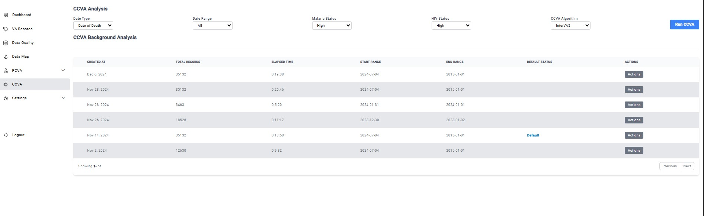
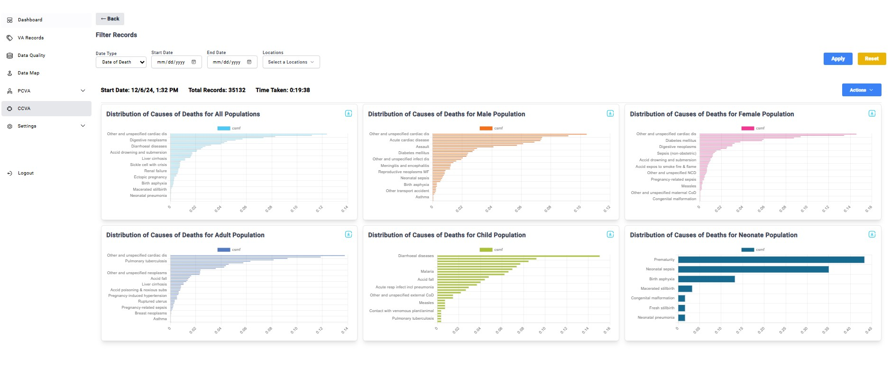

# CCVA
## CCVA
The Computer-Coded Verbal Autopsy (CCVA) tab provides access to various datasets currently available in the system. Within the CCVA Background Analysis Chart, users can view detailed information for each dataset, including:

- Date of creation
- Total records in the dataset
- Elapsed processing time
- Start and end ranges

The interface also displays the **default status**, indicating the dataset being used to populate the dashboard upon login. To update the default dataset, users can select the Action button at the end of the corresponding row and choose **Set Default.**

Selecting any dataset opens a dedicated page displaying its data through a series of visual charts. These charts represent the distribution of records across the following demographic groups:

- Total population
- Male population
- Female population
- Adult population
- Child population
- Neonatal population

## Downloading Records
Each individual chart with it's dataset can be downloaded in a range of different formats ranging from Images to Excel files by clicking the **blue donwload button** found at the top right of each chart.

Simply clicking the donwload button once will automatically intiate the donwnload from the system serves to the your computer.