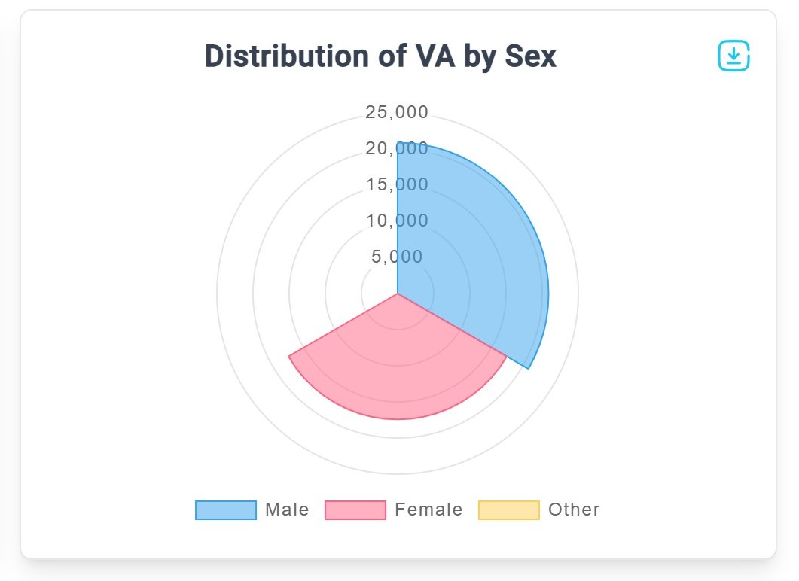

# Dashboard 
## Dashboard Overview

This is the default tab displayed upon logging in. The VMan logo is located at the top left and on the far right the profile picture is displayed providing access to options such as account settings and the sign-out feature when clicked.

In the center and on the right side of the screen, several charts present various datasets derived from the VA records accessible to the system. Each chart is clearly labeled to ensure straightforward interpretation of the data. A detailed review of these charts is provided below:
## Charts
### Monthly submissions chart

This chart displays the number of VA records uploaded to the system each month, measured in the thousands. Different years are represented using distinct colors to make comparisons easier. To download this dataset, simply click the blue download icon located at the top right corner of the chart 

### Distribution of VA by age groups

This chart illustrates the distribution of VA records across three age groups: neonates (infants less than four weeks old), children (ages 1 to 18 years), and adults (18 years and older). Hovering over each segment provides the exact percentage for that category. To download the dataset, click the blue download icon located at the top right corner of the chart

### Distribution of VA by sex

This chart displays the distribution of VA records by sex in intervals of five thousand. The data is categorized into three groups: male, female, and other/unspecified. Males are represented in blue, females in pink, and others/unspecified in yellow for easy identification. To download the dataset, click the blue download icon at the top right corner of the chart

### Cause of death charts

These charts display the distribution of various causes of death for different population groups, based on the current VA records. The population sets include the overall population, male population, female population, adult population, child population, and neonate population.

Toggling the top left button called **Toggle groups** allows for switching to switch between the different data sets. 

Individual datasets can be downloaded by clicking the blue download icon located at the top right of the chart.

### Latest submissions.

This chart displays the most recent VA record submissions from across the country, summarized by region, district, count, and the date of the last submission. The data is further categorized by adults, children, neonates, males, and females. The bottom bar of the chart shows the total number of the latest submissions. To download the dataset, click the blue download icon located at the top right corner of the chart

## Filtering Records
Filtering options for data being viewed and downloaded can be found at the top of most tabs.

Filtering can be done under the following parameters, 
 - Date Type: Choose from the following selection. 
(I).	Submission date
(II).	Date of death
(III).	Interview date
 - Start date: Select the desired starting date for the dataset.
 - End date: Select the desired ending date for the data set
 - Locations: Select the location from which records should be retrieved.
 
Once satisfied with the choices, click **APPLY** on the far right to apply the changes to the charts. Click Reset to revert the filters back to their default parameters. 

**Note:** Filters apply to all data sets throughout the system including other tabs. Remember this when moving from one tab to another.

## Downloading Records
Each individual chart with it's dataset can be downloaded in a range of different formats ranging from Images to Excel files by clicking the blue donwload button found at the top right of each chart.

Clicking the download button once automatically initiates the download from the system servers to the computer.