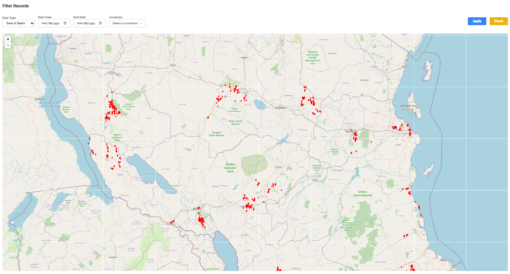

# Data Map
## Data Map
This tab features an interactive map of Tanzania, providing a visual representation of all available VA records across the country.

Each record is marked with a red pin, allowing users to quickly identify the geographical distribution of the interviews. Clicking on a pin reveals key details about the corresponding interview, including the region, district, date, interviewer name, and the device ID used during the data collection process.

The interactive map serves multiple purposes. It offers a clear view of the spatial distribution of VA interviews, enabling stakeholders to assess the extent of coverage and the progress made by interviewers in various regions. Additionally, the map highlights areas with the highest concentrations of recorded cases, providing valuable insights into potential disease patterns, regional trends, and other critical statistics.

By combining geospatial visualization with detailed record data, this tool supports data-driven decision-making and enhances the understanding of health trends and resource allocation needs across Tanzania.

## Filtering

Filtering options for data being viewed and downloaded can be found at the top of most tabs.
Filtering can be done under the following parameters,  
 - Date Type: Choose from the following selection. 
(I).	Submission date
(II).	Date of death
(III).	Interview date
 - Start date: Select the desired starting date for the dataset.
 - End date: Select the desired ending date for the data set
 - Locations: Select the location from which records should be retrieved.
 
Once satisfied with the choices click **APPLY** on the far right to apply the changes to the charts. Click Reset to revert the filters back to their default parameters.

These filters will render on the map and show the locations that align with the filter options chosen. 