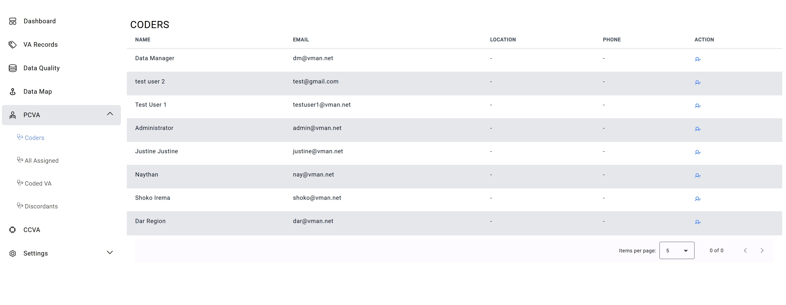
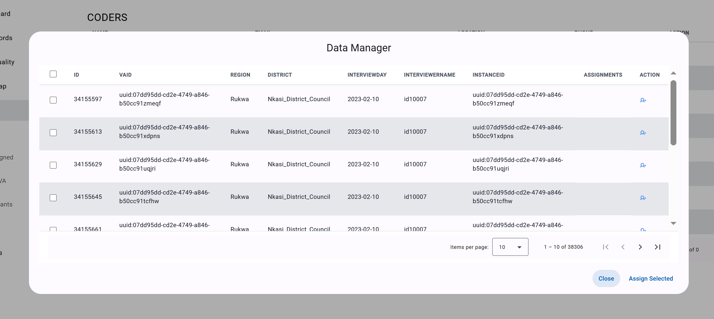
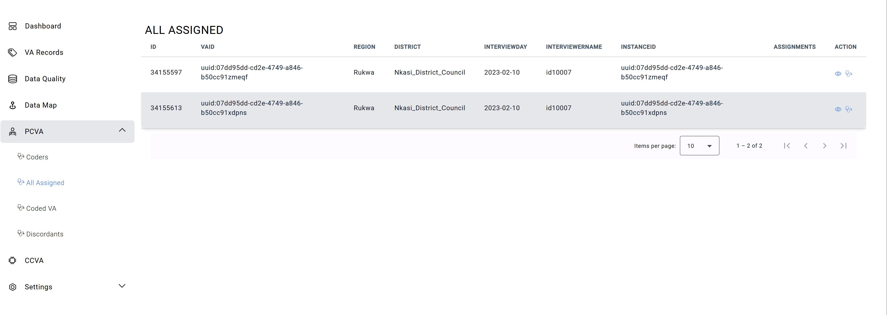
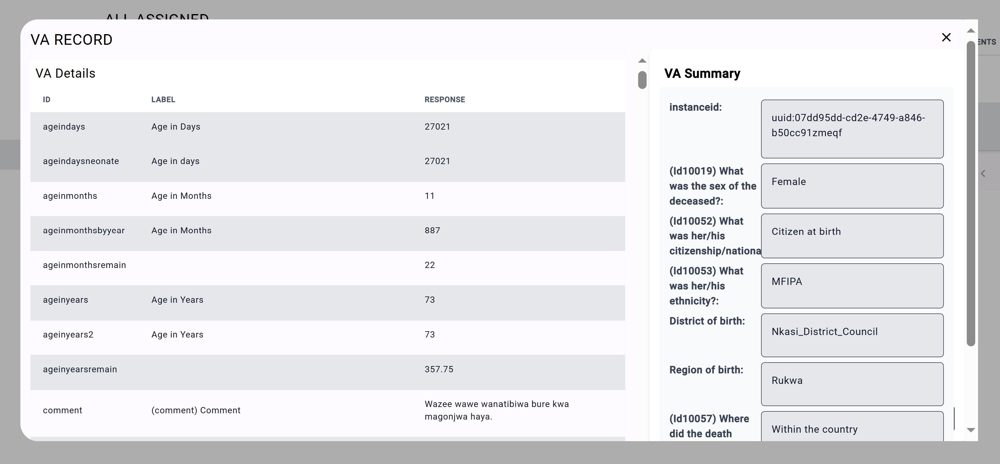

# PCVA
## PCVA
**Note:** Depending on the previlages asssinged,all or some options will be available in this tab.

The Physician-Coded Verbal Autopsy (PCVA) tab is a comprehensive and robust system designed to streamline and optimize the verbal autopsy coding and resolution process. It consists of four key components, each aimed at ensuring efficiency, accuracy, and consistency throughout the coding workflow:

**Coder Assignment:** This feature simplifies the process of assigning coders to specific cases, allowing for a well-organized and efficient workflow. It ensures that each case is handled by the appropriate coder, minimizing delays and improving overall productivity.

**VA Coding:** The VA coding component supports the systematic and structured entry of verbal autopsy data by designated coders. It ensures that data is consistently coded, reducing variability and maintaining high standards of accuracy across cases.

**Coding Comparison:** This functionality allows for the comparison of outputs from multiple coders, facilitating the detection of discrepancies and promoting consistency. By comparing results, it helps identify any inconsistencies in the coding process, ensuring the final data is reliable and accurate.

**Discordant Resolution:** The discordant resolution feature provides structured workflows to address discrepancies and disagreements between coders. It offers a systematic approach for resolving differences in coding interpretations, ensuring that all issues are addressed promptly and effectively. This process preserves the integrity of the data and ensures that the final coding reflects the most accurate possible cause of death.

## Coders
The Mini-tab displays a list of all available coders, providing essential details such as their name, email, location, and phone number. To assign a coder one or more VA records, simply click the action icon next to their name. The action icon is represented by a person with a plus sign next to them found in the Action column 

Clicking this icon opens the **Data Manager** tab, where all current VA records are displayed. From here, you can select any number of records that you wish to assign to the coder. Once the desired records are selected, click **Assign Selected** at the bottom right to complete the assignment. 

This feature allows for the assignment of multiple records to a coder at once, streamlining the process and ensuring efficient task management.

## All Assigned

This Mini-tab displays all the records assigned to a specific coder for reviewing and coding. Preliminary information is shown in the chart, but for more details, users can click the View option at the end of each row, represented by the **Eye icon** in the **Action Column**. This will open a new tab displaying the complete details of the VA record.

Also in the Action column, one can find a **Stethoscope icon**. As mentioned, clicking the Eye icon opens the summary tab for the VA record. On the other hand, clicking the Stethoscope icon opens the **Coding Sheet** tab, where the coder can review all responses within the VA and determine the cause of death. After deciding on the cause, the coder can input this information into the coding sheet and submit it for approval. 

## Coded VA

Under this Mini-tab, the coder will be abale to see all VA records which have been coded. 

## Discordants

The Discordants tab allows coders to view VA records that have been flagged due to mis-matching of the underlying cause of death. 

If the cause of death does not match, both coders will find the record in their Discordant tab. Coders will then have the opportunity to review the record again and discuss the differences until they reach a consensus. Once a uniform agreement is reached, either one or both coders will amend their coding sheets to align with the agreed cause of death and resubmit the updated coding for approval. This process ensures that the final coding reflects a shared, accurate conclusion.