# Settings

## Settings

**Note:** Depending on the previlages asssinged,all or some options will be available in this tab.

The settings page serves as the backbone of the system, providing a range of options to customize and optimize its functionality. It includes system-wide configurations, data synchronization features, and tools for managing users effectively.

## Configurations

The configuration Tab offers a wide range of system changes that affect everything from appearance to ODK data synchronization. 

### System Configuration:

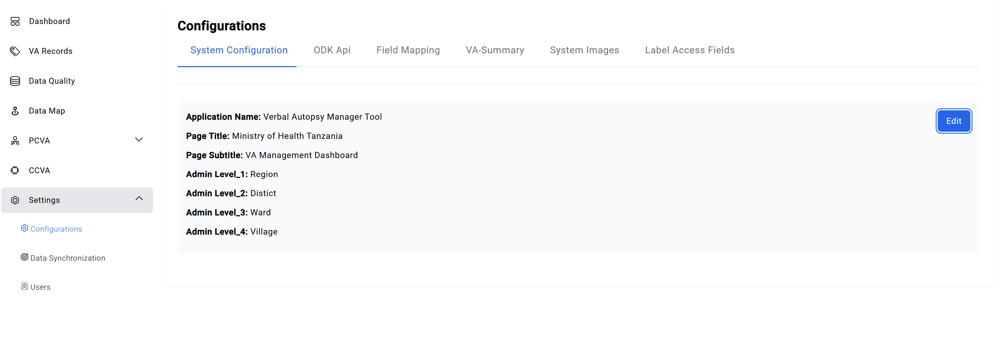

This section enables customization on elements of the system's appearance, including the page title, subtitle, and the hierarchy of admin levels.

To make edits, click the blue Edit button located on the far right. This will open a panel where you can make the desired changes

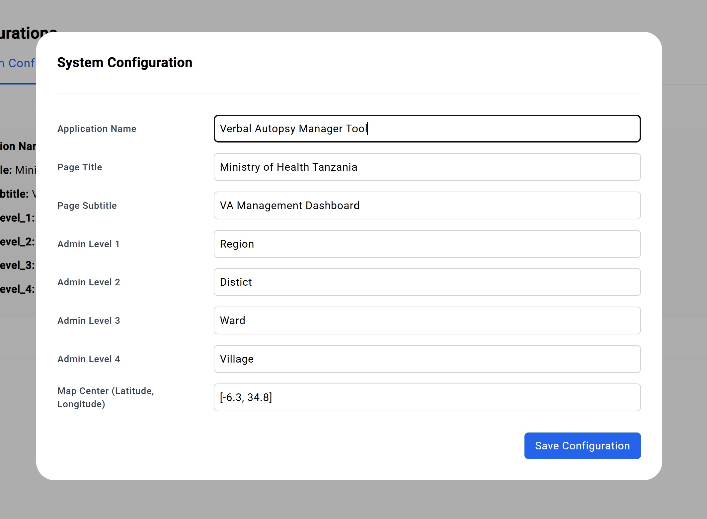

Once satsfied with the changes made, click on **Save Configurations** to allow the changes to take place. Logging out and back in may be necessary for some changes to take effect. 

### ODK Api

This section focuses on the configuration and settings for the ODK (Open Data Kit) integration. Adjusting these settings allows the system to dynamically update its data sources and refine the datasets displayed and stored within the platform. Changes made here directly impact how and where the system retrieves data, ensuring that the displayed information aligns with the updated configurations

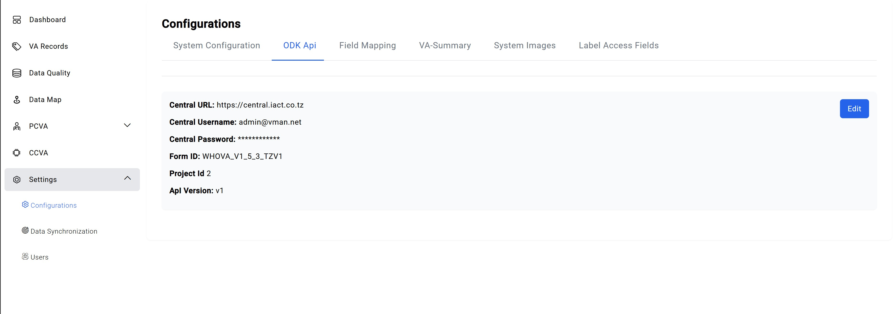

To Edit the configurations click the Blue Edit at the far right. This will open a Mini-tab **ODK API Configuration** where one will have to edit the following:

- ODK Central URL 
- Username 
- Password
- Form ID
- Project ID
- API Version

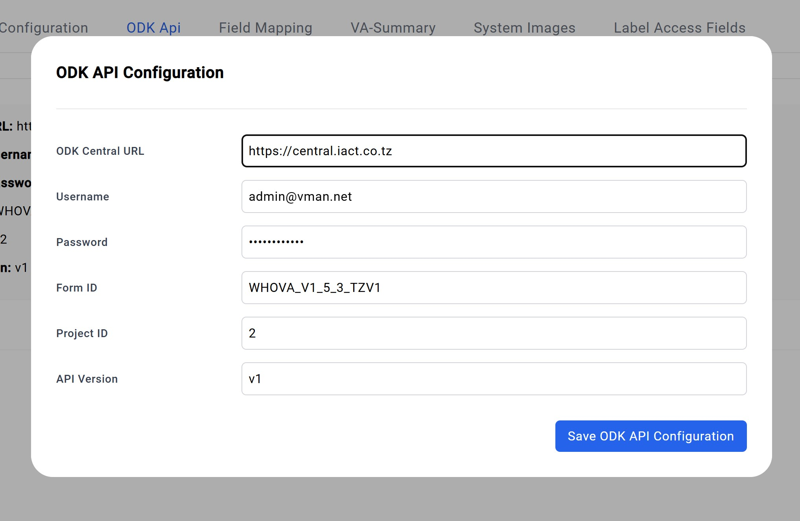

After editting these fields, save the changes by clicking **Save ODK API Configuration** at the bottom right of the Mini-tab. 

### Field Mapping

This tab carries all the necceasary designation used in pulling information fron the records allowing the system to know where to find certain piece of information and how to display this information across the system. To edit this, simply click the **Blue edit button** at the far right.  

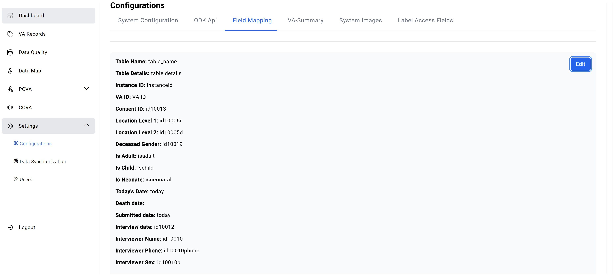

This will open a mini-tab, **Field Mapping**, where various fields can be adjusted to align with system requirements and set parameters.

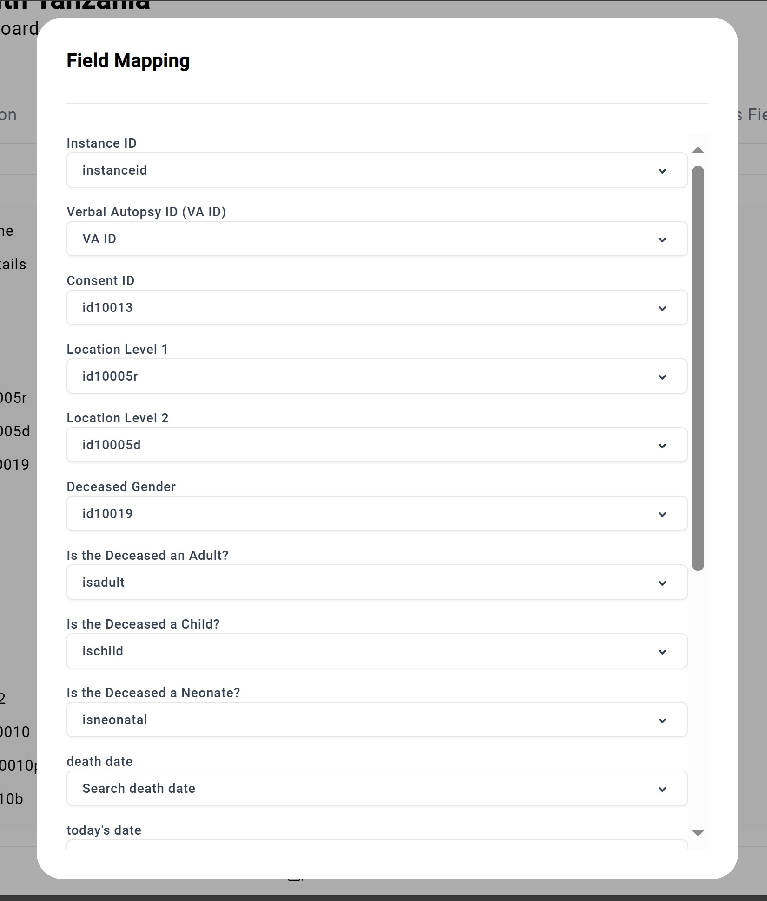

Once satisfied with changes, save them by clicking **Save Field Mapping** at the bottom right of the Mini-tab. this will save the changes. 

### VA Summary

This section governs the display settings for the VA Records Summary, accessible via the View button within the **VA Records** tab for individual records. It also applies to the summary view available under the **All Assigned** tab when selecting the View icon, as well as other relevant sections of the system. 

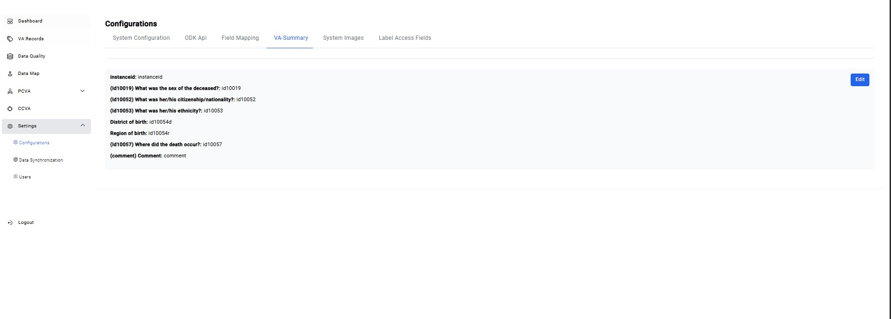

Modifying these settings directly alters the fields and data visible in these views, ensuring that the displayed information reflects the selected configuration. 

To edit this click the **Blue eidt button** at the far right opening up the edit tab. 

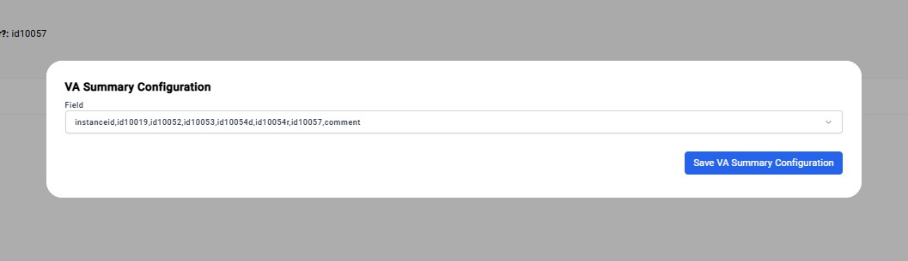

Select the changes need then save them by clicking **Save VA Summary Configuration**. 

### System Images

This section enables changes to images across the system, such as the favicon, system logo, and login image.

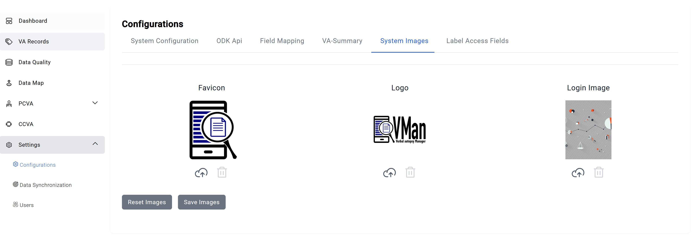

To change these images simple click the upload button indicated by the **Cloud Icon.** This will upload images directly form their desktop to the system and change them. To save these changes click the **Save Images** button found under the images. To return to default images click the **Revert Images** button found along sign.  

### label Access Fields

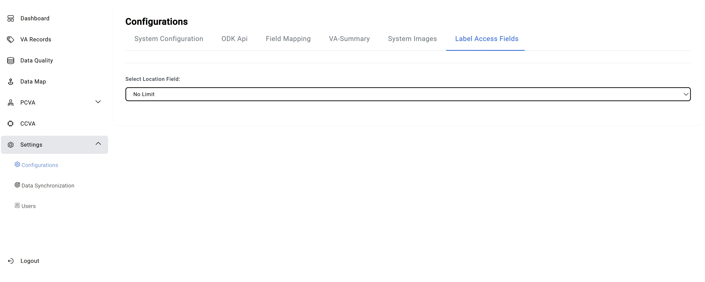

## Data Synchronization

Pending..

## Users/Users Management
### Users

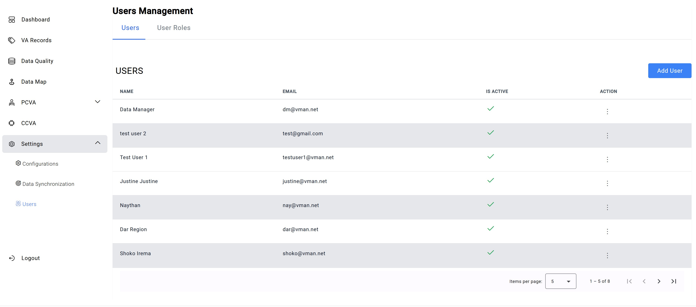

This section provides an overview of all users currently in the system, displaying their name, email, and active status. Additional functions are available under the Action column such as **View**, **Edit**, and **Deactivate**.

- View: Opens a data manager tab containing a summary of the user’s information and roles.

- Deactivate: **[Add explanation here about what this option does.]**

- Edit: Enables more detailed changes to the user’s profile and settings. 

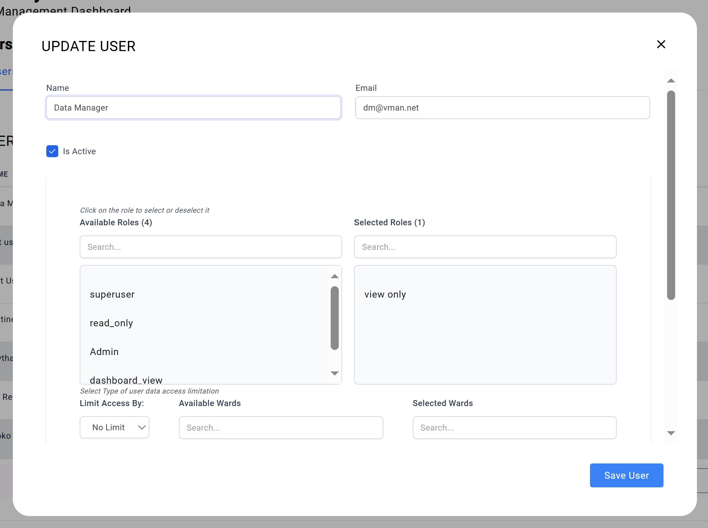

You can edit the following details for a user:

- Name
- Email
- Active status
- Assigned user roles (add or remove)
- Regional or district access restrictions
- Password

After making the necessary changes, click Save User at the bottom right of the tab to apply them.

### User Roles

**Note:** Depending on the previlages asssinged,all or some options will be available in this tab. 

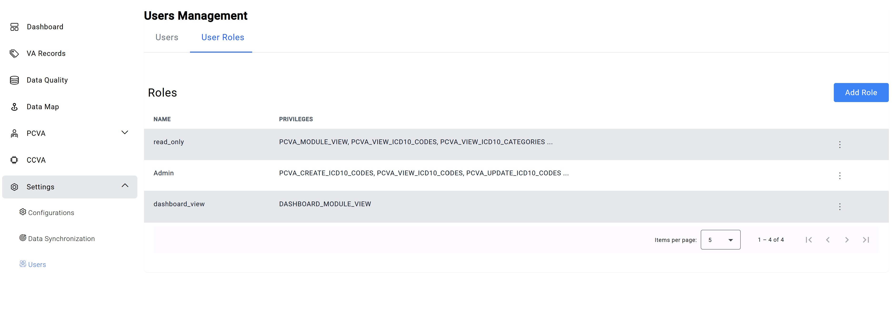

This section focuses on assigning privileges to different roles, defining what each user role can access and do within the system.

The Options button at the end of each role provides the following functions:

- View: Displays the privileges assigned to a specific role.

- Delete: Removes a role from the system.

- Edit: Enables more detailed modifications to the role’s privileges. 

 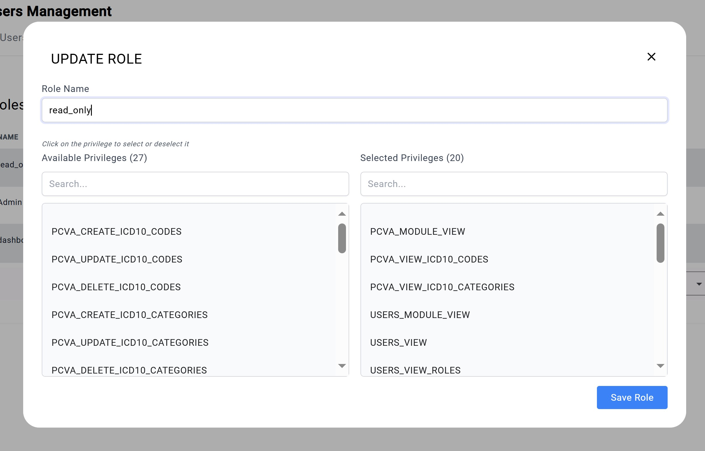

This option opens a tab where the role name can be modified, and its assigned privileges can be adjusted.

- The left column lists all available privileges.

- The right column shows the privileges currently assigned to the role.

Privilages can be added or removed by clicking on them directly. Onces satisfied with the changes, click **Save Role** at the bottom right of the tab to apply them. 

## Adding Users

To add users, navigate to **Settings** > **Users** in the User Management section. On the Users tab, click the blue **Add User** button located on the right side of the tab

This will open up a Mini-tab where the following information will be required 

- Name
- Email
- Active status
- Assigned user roles (add or remove)
- Regional or district access restrictions
- Password

Once these fields are filled Click the blue **Save user** button on the bottom right of the tab.
